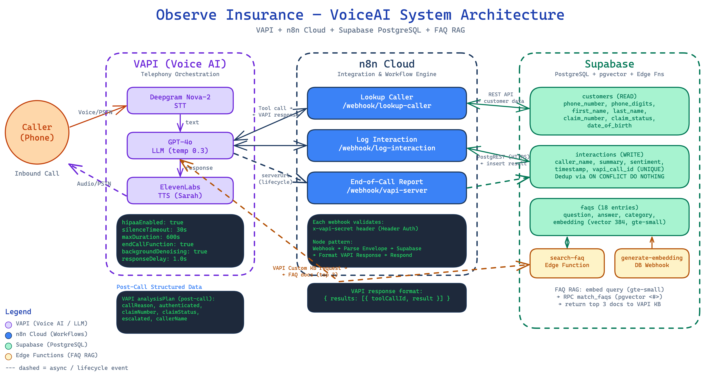
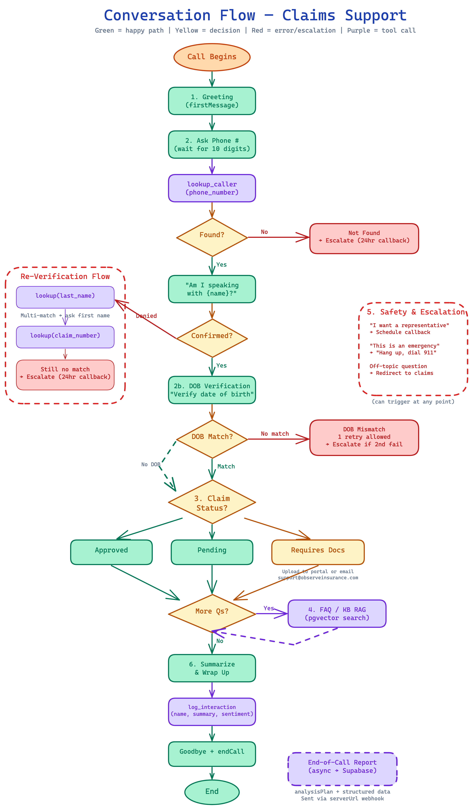

# Vsupport-agent

A production-ready **VoiceAI insurance claims support agent** for "Observe Insurance." Callers dial in, authenticate via phone number and date of birth, and get real-time claim status updates, FAQ answers, and escalation to human representatives — all through natural voice conversation.



## How It Works

```
Caller  ──phone──▶  VAPI  (Deepgram STT → GPT-4o → ElevenLabs TTS)
                      │ tool calls
                      ▼
                   n8n Cloud  (webhook auth + envelope parsing)
                      │ REST API (PostgREST)
                      ▼
                Supabase PostgreSQL
                   ├── customers     (read — account lookup)
                   ├── interactions  (write — call logs)
                   └── faqs          (pgvector — FAQ retrieval)
```

1. **Caller dials in** — VAPI handles telephony, streams audio through Deepgram (STT), GPT-4o (conversation), and ElevenLabs (TTS)
2. **Authentication** — The agent asks for phone number → confirms name → verifies date of birth
3. **Claim lookup** — GPT-4o triggers `lookup_caller` tool → n8n webhook → Supabase query → result returned to caller
4. **FAQ handling** — General questions route through VAPI's Custom Knowledge Base → Supabase Edge Function (pgvector semantic search with gte-small embeddings)
5. **Call logging** — Interactions logged via `log_interaction` tool + end-of-call report (with dedup)



## Tech Stack

| Layer | Technology | Role |
|-------|-----------|------|
| **Telephony & Orchestration** | [VAPI](https://vapi.ai) | Call handling, STT/LLM/TTS routing |
| **Speech-to-Text** | Deepgram Nova-2 | Real-time transcription |
| **LLM** | GPT-4o (via VAPI) | Conversational AI, tool calling |
| **Text-to-Speech** | ElevenLabs ("Sarah") | Natural voice synthesis |
| **Workflow Engine** | n8n Cloud | Webhook auth, envelope parsing, all DB operations |
| **Database** | Supabase PostgreSQL | Customers, interactions, FAQs (pgvector) |
| **FAQ Search** | Supabase Edge Functions + pgvector | Semantic search with gte-small embeddings |
| **Config** | Python + Pydantic Settings | Environment configuration |

## Project Structure

```
Vsupport-agent/
├── app/
│   └── config.py                 # Pydantic Settings (.env)
├── vapi/
│   ├── assistant_config.json     # Full VAPI assistant config (GPT-4o, tools, analysis)
│   └── system_prompt.md          # Conversational system prompt (version-controlled)
├── n8n/workflows/                # n8n workflow JSON exports
│   ├── lookup-caller.json        # Phone/name/claim lookup → Supabase
│   ├── log-interaction.json      # Call interaction logging → Supabase
│   └── end-of-call-report.json   # Post-call summary with dedup
├── supabase/
│   ├── migrations/               # DDL: customers, interactions, faqs, pgvector
│   ├── functions/
│   │   ├── generate-embedding/   # Auto-embed FAQ rows (gte-small, 384 dims)
│   │   └── search-faq/           # VAPI Custom KB endpoint (pgvector search)
│   ├── seed.sql                  # 5 sample customers
│   └── seed_faqs.sql             # 18 FAQ entries
├── scripts/
│   ├── deploy-vapi.sh            # Resolve placeholders → deploy assistant
│   ├── happy-path-script.md      # Demo: approved claim flow
│   └── error-path-script.md      # Demo: re-verification & error flows
├── diagrams/                     # Excalidraw diagrams + rendered PNGs
├── data/faqs.json                # FAQ source data (18 entries)
├── tests/                        # 10 tests (VAPI envelope parsing)
├── docs/
│   └── interview-briefing.md     # Technical write-up (architecture, costs, HIPAA)
└── requirements.txt
```

## Getting Started

### Prerequisites

- Python 3.12+
- Accounts: [VAPI](https://vapi.ai), [n8n Cloud](https://n8n.io), [Supabase](https://supabase.com)

### Setup

```bash
# Clone and install
git clone <repo-url>
cd Vsupport-agent
python -m venv .venv && source .venv/bin/activate
pip install -r requirements.txt

# Configure environment
cp .env.example .env
# Fill in: VAPI_API_KEY, VAPI_SECRET, N8N_API_KEY, N8N_WEBHOOK_BASE_URL,
#          SUPABASE_URL, SUPABASE_SERVICE_ROLE_KEY
```

### Database Setup

Run migrations against your Supabase project (via Dashboard SQL Editor or Supabase CLI):

```sql
-- Run in order:
-- supabase/migrations/001_initial_schema.sql    (customers + interactions)
-- supabase/migrations/002_phone_digits_column.sql
-- supabase/migrations/003_add_date_of_birth.sql
-- supabase/migrations/004_enable_pgvector.sql
-- supabase/migrations/005_faqs_table.sql
```

Then seed sample data:

```bash
# Apply seed data
psql $DATABASE_URL -f supabase/seed.sql
psql $DATABASE_URL -f supabase/seed_faqs.sql
```

### Deploy Edge Functions

```bash
supabase functions deploy generate-embedding
supabase functions deploy search-faq
supabase secrets set VAPI_SECRET=your_secret
```

### Deploy VAPI Assistant

```bash
./scripts/deploy-vapi.sh
```

This resolves `{{N8N_WEBHOOK_BASE_URL}}`, `{{VAPI_SECRET}}`, and `{{VAPI_KB_ID}}` placeholders in the config and creates/updates the assistant via the VAPI REST API.

### Run Tests

```bash
pytest tests/
```

All 10 tests cover VAPI envelope parsing.

## n8n Workflows

Three workflows running on n8n Cloud, all authenticated via `X-Vapi-Secret` header:

| Workflow | Webhook Path | Purpose |
|----------|-------------|---------|
| **Lookup Caller** | `/webhook/lookup-caller` | Account lookup by phone, last name, or claim number |
| **Log Interaction** | `/webhook/log-interaction` | Log call summary, sentiment, caller info |
| **End-of-Call Report** | `/webhook/vapi-server` | Post-call report with UNIQUE constraint dedup |

## VAPI Assistant

- **Model**: GPT-4o (temperature 0.3)
- **Voice**: ElevenLabs "Sarah"
- **Transcriber**: Deepgram Nova-2
- **HIPAA**: Enabled (BAA-eligible, no call recording)
- **Knowledge Base**: Custom KB backed by Supabase pgvector (18 FAQs)
- **Max call duration**: 10 minutes
- **Tools**: `lookup_caller`, `log_interaction`, `endCall`

### Conversation Flow

1. **Greeting** → automatic first message
2. **Authentication** → phone lookup → name confirmation → DOB verification
3. **Claim status** → approved / pending / requires documentation
4. **FAQ handling** → semantic search via pgvector Knowledge Base
5. **Escalation** → human callback arranged when needed
6. **Wrap-up** → summary, log interaction, graceful hangup

## Database Schema

**Supabase PostgreSQL** with three tables:

- **customers** — `first_name`, `last_name`, `phone_number` (E.164), `phone_digits` (generated), `claim_number` (unique), `claim_status`, `claim_details`, `date_of_birth`
- **interactions** — `caller_name`, `phone_number`, `summary`, `sentiment`, `vapi_call_id` (unique, enables dedup)
- **faqs** — `question`, `answer`, `category`, `embedding` (vector(384) via gte-small)

## Key Design Decisions

- **n8n as primary integration layer** — All VAPI webhooks and DB operations go through n8n Cloud, keeping the architecture simple and the codebase small.
- **Supabase over Airtable** — Migrated from Airtable for pgvector support (FAQ RAG), proper constraints (UNIQUE for dedup), and generated columns (`phone_digits` to avoid PostgREST encoding bugs).
- **`phone_digits` generated column** — Strips `+` from E.164 phone numbers to work around the Supabase n8n node's `encodeURI()` mangling of `+` in PostgREST filter strings.
- **UNIQUE constraint dedup** — End-of-call report uses `INSERT ON CONFLICT DO NOTHING` via `vapi_call_id` uniqueness, replacing a fragile 10-second wait + search approach.
- **FAQ RAG via pgvector** — gte-small embeddings (384 dims) with inner product similarity search, served through Supabase Edge Functions as a VAPI Custom Knowledge Base.

## Cost Estimate

~**$0.24 per call** (based on 3-minute average):

| Component | Cost/call |
|-----------|----------|
| VAPI platform | $0.05 |
| Deepgram STT | $0.04 |
| GPT-4o | $0.08 |
| ElevenLabs TTS | $0.06 |
| Supabase | $0.001 |
| **Total** | **~$0.24** |

See `docs/interview-briefing.md` for volume scaling analysis and production considerations.

## Testing

```bash
pytest tests/ -v
```

| Test File | Tests | Coverage |
|-----------|-------|----------|
| `test_vapi_envelope.py` | 10 | VAPI tool-call & EOC envelope parsing |

## Documentation

- `docs/interview-briefing.md` — Full technical write-up (architecture, HIPAA, costs, scaling, war stories)
- `vapi/system_prompt.md` — Complete conversational system prompt
- `.agent/` — Living project documentation (architecture, SOPs, decisions, gotchas)
